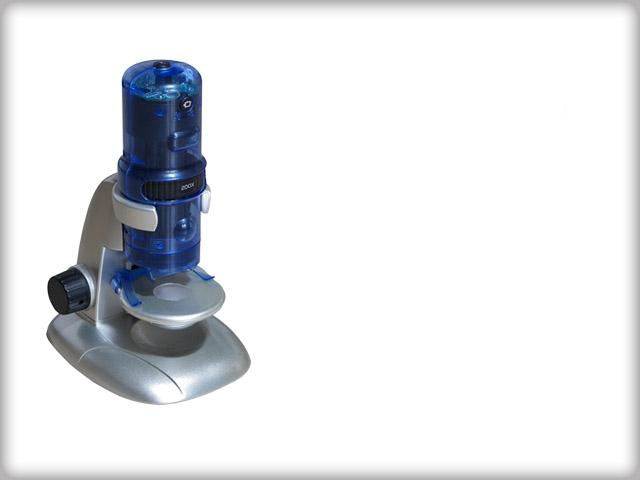

# USB_driver
AVEO Cheetah3 USB2.0 Device



[Drivers Download](https://mega.nz/folder/nmABhLZZ#gBa-rWZZtOyFcPWrrKPYKw)

---

## Mikroskop AVEO — jak to działa

### Sprzęt

Mikroskop to kamera USB zbudowana z trzech warstw:

```
[Obiektyw + LED] → [Sensor MT9M111] → [AVEO Cheetah 8051] → [USB 2.0 High-Speed]
```

**Sensor Aptina MT9M111** to matryca CMOS 1280×1024 (SXGA) z filtrem Bayera (RGGB).
Produkuje surowe dane pikselowe i komunikuje się z mostem AVEO przez magistralę I²C
(konfiguracja rejestrów) oraz równoległy port danych (strumień video).

**Mostek AVEO Cheetah** to mikrokontroler 8051 z wbudowanym kontrolerem USB.
Jego firmware (4928 bajtów) jest uploadowany przez host przy każdym uruchomieniu,
bo chip nie ma pamięci nieulotnej. Zadania 8051:

- odbiera komendy konfiguracyjne od hosta przez USB vendor requests
- konfiguruje MT9M111 przez I²C
- konwertuje dane Bayera z sensora na format UYVY
- strumieniuje UYVY przez izochroniczny endpoint USB (EP 0x83)

---

### Protokół USB

**Inicjalizacja** (jednorazowa po podłączeniu):

| Krok | Komenda                      | Opis                            |
|------|------------------------------|---------------------------------|
| 1    | bRequest=4, wIndex=chunk_nr  | Upload firmware (154 × 32 B)    |
| 2    | bRequest=5, wIndex=1         | Boot 8051, czeka 500 ms         |
| 3    | bRequest=0x08                | Odczyt wersji → `Ver R003.001`  |

**Start streamingu:**

| Krok | Komenda                                    | Opis                                                    |
|------|--------------------------------------------|---------------------------------------------------------|
| 1    | SET_INTERFACE alt=5                        | Aktywacja ISO endpoint (3072 B/pakiet, ×3 transakcje)   |
| 2    | bRequest=0x32, wValue=1280, wIndex=0x1400  | Rozdzielczość 1280×1024, format UYVY                    |
| 3    | bRequest=0x22, wValue=1, wIndex=2          | START capture                                           |
| 4    | bRequest=0x5f, wValue=1                    | Włączenie Auto Exposure                                 |
| 5    | bRequest=0x69/6a/6b, wValue=50             | Parametry AE (target / gain / czas)                     |
| 6    | bRequest=0x6c/6d/6e/...                    | Balans bieli, ostrość, gamma itd.                       |

**Komendy konfiguracyjne sensora** (przez 8051 → I²C do MT9M111):

| bRequest    | Parametr                                        |
|-------------|-------------------------------------------------|
| 0x5c/5d/5e  | Nasycenie R/G/B                                 |
| 0x5f        | Auto Exposure on/off                            |
| 0x69/6a/6b  | AE target / gain / exposure                     |
| 0x6c        | Wzmocnienie koloru (R/G/B kanały, wIndex=1/2/3) |
| 0x6d        | Jasność (brightness)                            |
| 0x6e        | Kontrast                                        |
| 0x6f        | Ostrość (sharpness)                             |
| 0x70/71     | Gamma                                           |
| 0x72        | Odcień (hue)                                    |
| 0x73        | Nasycenie (saturation)                          |

---

### Format danych video

Strumień ISO zawiera ramki UYVY rozdzielone znacznikami synchronizacji:

```
[00 FF FF FF][10 bajtów nagłówka][... dane UYVY ...]
     sync          header             1280×1024 × 2 B = 2 621 440 B
```

**Format UYVY** (4 bajty = 2 piksele):

```
U₀  Y₀  V₀  Y₁
↑   ↑   ↑   ↑
Cb  luma Cr  luma
(wspólne dla obu pikseli)
```

Konwersja do RGB (BT.601):

```
R = Y + 1.402 × (V−128)
G = Y − 0.344 × (U−128) − 0.714 × (V−128)
B = Y + 1.772 × (U−128)
```

---

### Auto Exposure

Po uruchomieniu AE (`0x5f=1`) firmware 8051 automatycznie dobiera czas ekspozycji MT9M111.
Przez pierwsze ~30 sekund wartości Y (luma) są niskie (Y≈17 = prawie czarne) — to czas
konwergencji algorytmu AE. Po stabilizacji Y osiąga wartości odpowiednie do oświetlenia sceny.
Podświetlenie LED mikroskopu jest sterowane sprzętowo (przełącznik fizyczny) i nie jest
widoczne z poziomu USB.

### Usage

```
sudo modprobe videodev
sudo modprobe videobuf2-v4l2
sudo modprobe videobuf2-vmalloc
sudo modprobe videobuf2-common
sudo modprobe gspca_main

sudo modprobe ./gspca_aveo.ko
```
---